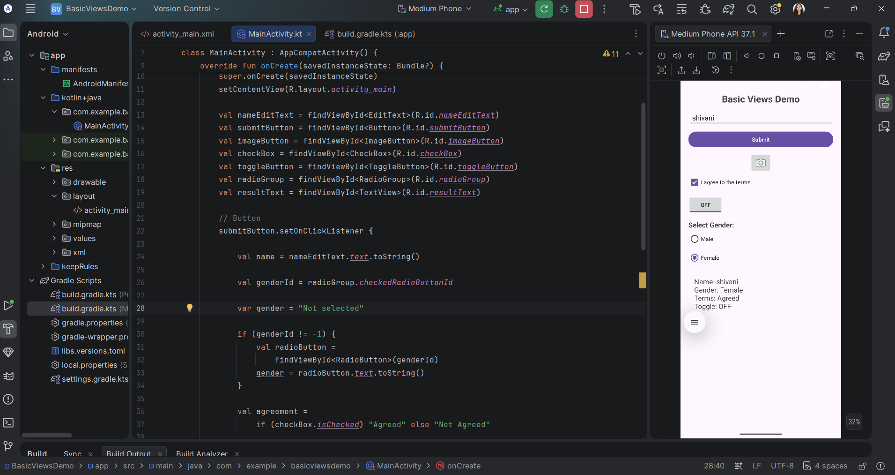

# BasicViewsDemo

A simple Android application that demonstrates the usage of common Android UI components (Views) in a layout.

## Features

This project showcases several fundamental Android Views and how to interact with them programmatically in Kotlin:

- **TextView**: Used for displaying static and dynamic text.
- **EditText**: Allows users to input text (e.g., entering a name).
- **Button**: A standard button to trigger actions (e.g., submitting a form).
- **ImageButton**: A button with an image source.
- **CheckBox**: A two-state toggle for binary choices (e.g., agreeing to terms).
- **ToggleButton**: A specialized two-state button with text indicators (ON/OFF).
- **RadioGroup & RadioButton**: Provides a set of mutually exclusive options (e.g., selecting gender).
- **ScrollView**: Ensures the UI remains accessible on smaller screens by allowing vertical scrolling.

## How it Works

1.  The user enters their name in the `EditText`.
2.  The user selects their gender using `RadioButton`s within a `RadioGroup`.
3.  The user can toggle their agreement status via a `CheckBox`.
4.  The `ToggleButton` demonstrates state-change listeners.
5.  When the **Submit** button is clicked, the app gathers the state from all these views and displays a summary in a `TextView` at the bottom.
6.  The `ImageButton` demonstrates a simple `Toast` notification.

## Project Structure

- `app/src/main/java/com/example/basicviewsdemo/MainActivity.kt`: Contains the logic for handling view interactions and click listeners.
- `app/src/main/res/layout/activity_main.xml`: Defines the user interface using XML layout with a `ScrollView` and `LinearLayout`.

## Getting Started

1.  Clone this repository.
2.  Open the project in Android Studio.
3.  Build and run the app on an Android emulator or a physical device.

## Technologies Used

- **Language**: Kotlin
- **UI Framework**: Android Views (XML-based)
- **Minimum SDK**: Defined in `app/build.gradle.kts` (standard defaults).
## Application Screenshot

